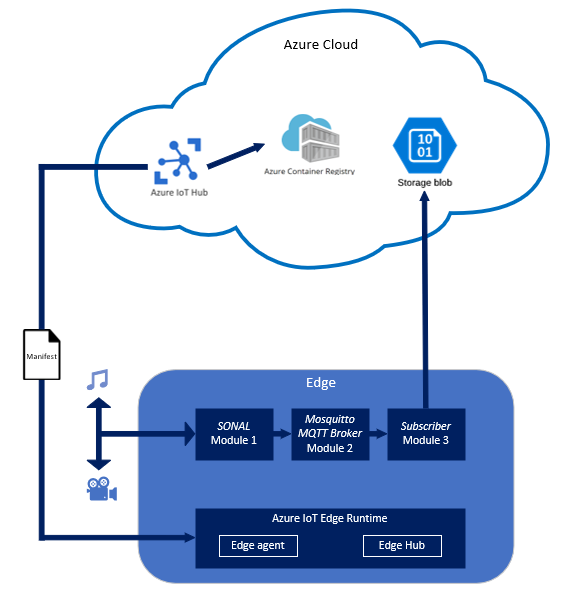
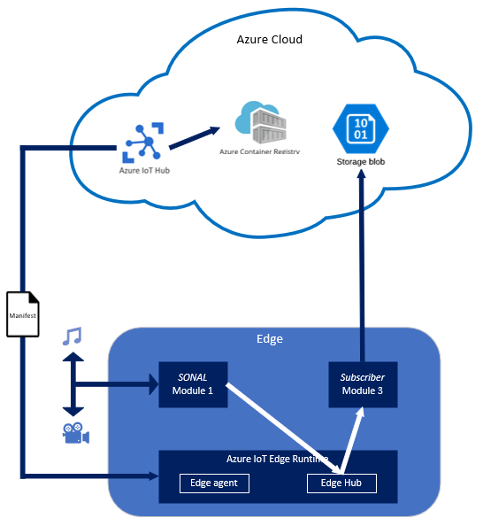
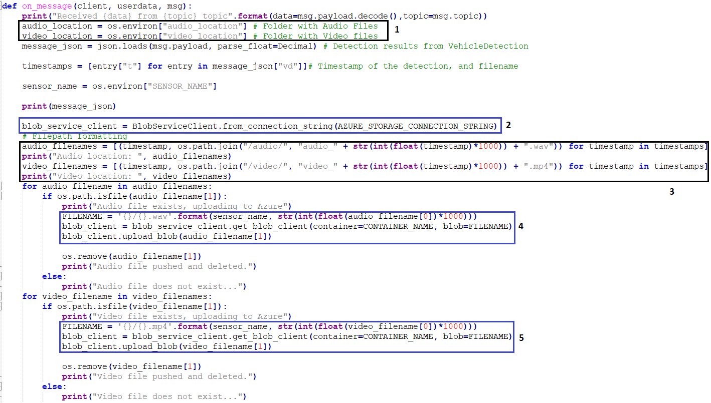

# IoT - Projet Securaxis : Documentation 

###### Dylan Canton & Salim Grayaa

###### 24.11.2022

---

Lien du repos Github : https://github.com/Cantondy/MA_IoT-Securaxis


## Architecture

Le schéma ci-dessous montre l'architecture utilisée pour l'implémentation de ce projet.



---


L'utilisation de l'écosystème Azure et de ses éléments joue un rôle central. Cependant seulement certains éléments ont été utilisé dans ce projet :

**Azure IoT Hub**

L'*Azure IoT Hub* permet de gérer les messages des différents modules à l'aide du *Azure Iot Edge Runtime* installé sur le Device (Raspberry Pi). 

Il joue également un rôle au niveau de la gestion des images de containers, il récupère les images de conteneurs sur le *Container Registry* pour ensuite les transmettre au *Azure IoT Edge Runtime* sous la forme d'un manifest. Cela permet de mettre à jour les images des conteneurs des 3 modules présents sur le Device.

**Azure Container Registry**

Le *container registry* permet de stocker des images docker afin de les utiliser ensuite au niveau du Edge pour construire les 3 modules nécessaires au projet. Ces images sont récupérées depuis le *container registry* par *Azure IoT Hub*, qui va ensuite les transmettre au *Azure IoT Edge Runtime*, ce dernier va alors les utiliser pour construire les modules SONAL, MQTT Broker et Subscriber. 

L'utilisation d'un registre de container au sein même d'Azure, contrairement à l'utilisation d'un *DockerHub* par exemple, permet de rester dans l'écosystème et de tirer profit des facilités d'échange entre l'*Azure Container Registry* et l'*Azure IoT Hub*. 

**Storage blob**

Le *Blob Storage* est l'*object storage* d'Azure, il est utilisé par le module du Subscriber qui va y stocker les données récoltées par l'application SONAL, à savoir donc des fichiers audios et vidéos. 

**Azure IoT Edge Runtime**

Le *IoT Edge Runtime* est installé sur le Device pour lui permettre de communiquer avec l'*Azure IoT Hub*. 

---


Initialement, il était prévu d'utiliser le Broker MQTT d'Azure (*Azure IoT Hub MQTT*) présent dans le *Edge Hub* avec le module SONAL et le module du Subscriber. La classe `IoTHubModuleClient` étant utilisée pour la communication entre les 2 modules (SONAL et Subscriber). (https://github.com/Azure/azure-iot-sdk-python/tree/main/samples).



Cependant, alors que le *Edge Hub* parvient à se connecter correctement au module SONAL, il n'arrivent pas à se connecter au module du Subscriber ce qui rend impossible ensuite l'envoie des données au *Storage Blob*. Après plusieurs recherches, il s'est avéré que le Broker d'Azure ne peut se connecter qu'à un module à la fois et qu'il est déconseillé d'utiliser L'*Azure IoT Hub* comme Broker (https://learn.microsoft.com/en-us/answers/questions/753353/publish-and-subscribe-with-azure-iot-edge-schema-v.html). Le choix a donc été fait d'utiliser à la place le Broker MQTT *Mosquitto* qui s'avère pleinement fonctionnel dans la solution actuelle. 


## Application

**Module SONAL**

Le module SONAL contient l'application du même nom qui permet de détecter un véhicule et récupérer l'image ainsi que le son associé. Il est nécessaire ici de changer le contenu de script `communicatetomqtt.py`.

La fonction `sendBulkToMQTT` permet de se connecter au broker et d'envoyer des messages contenant les identifiants des fichiers audios et vidéos ainsi d’autres informations utiles.

```python
def sendBulkToMQTT(self, bulk_array):
        try:
            self._mqtt.connect(self.host,self.port)
            logger.info('%s: Success Connection to the broker',type(self).__name__)
        except:
            logger.error('%s: Failed to connect to MQTT Broker: %s ',type(self).__name__,error)
        try:
            logger.info('%s: Send data to Broker - bulk_array = %s',type(self).__name__,bulk_array)
            array = json.dumps(bulk_array)
            result = self._mqtt.publish(self._topic,array)
            if (result[0]==0):
                 logger.info('%s: Send data to Broker - Published[%s]',type(self).__name__,result[1])
            else:
                 logger.info('%s: error Sending data to Broker ',type(self).__name__)
        except Exception as error:
            logging.error('%s: send data error %s',type(self).__name__,error)

```


**Module Mosquitto (MQTT Broker)**

Ce module contient un Broker MQTT open source appelé *Mosquitto* (https://mosquitto.org/). Il faut tout d'abord télécharger l’image de *Mosquitto* à partir de DockerHub (https://hub.docker.com/_/eclipse-mosquitto) et ensuite modifier le fichier `mosquitto.conf` pour configurer le port et permettre l’accès anonyme au broker.

Voici la configuration appliquée au fichier `mosquitto.conf` : 

* On configure la persistance ainsi que le port d'écoute (1883).
* L'authentification est mise en anonyme

```python
persistence true
persistence_location /mosquitto/data/
log_dest file /mosquitto/log/mosquitto.log
listener 1883

## Authentication ##
allow_anonymous true 
```


**Module Subscriber**

Le module du Subscriber permet de récupérer les données provenant de SONAL qui sont transmissent par le MQTT Broker. Il s'occupe ensuite de les envoyer au *Storage Blob* d'Azure pour stockage. Nous allons décrire ici le contenu du fichier `app.py` qui effectue le travail du Subscriber.

Il convient tout d'abord d'importer un client MQTT (`paho.mqtt.client`) afin que le Subscriber puisse se connecter au Brokee MQTT. Afin d'envoyer les informations au *Blob Storage*, il faut également importer le package `azure.storage.blob`. 

```python
import paho.mqtt.client as mqtt
import os
import json
from azure.storage.blob import BlobServiceClient
from decimal import Decimal
```


La fonction `on_connect` permet ensuite, lorsque la connexion est établie avec le Broker MQTT, d'effectuer le Subscribe afin de recevoir les messages de la part du Broker.

```python
CONTAINER_NAME = os.environ["CONTAINER_NAME"]
AZURE_STORAGE_CONNECTION_STRING=os.environ["AZURE_STORAGE_CONNECTION_STRING"]
def on_connect(client, userdata, flags, rc):
    print("Connected with result code "+str(rc))
    client.subscribe(os.environ["topic"])
```


La fonction `on_message` permet, lors de la réception d'un message, de récupérer les fichiers et de les envoyer au *Blob Storage* d'Azure : 

1. On récupère tout d'abord le chemin des dossiers contenant les fichiers Vidéo et Audio (ces fichiers proviennent de l'application SONAL). On récupère également les timestamps et noms des fichiers issus de la détection.
2. La connexion au *Blob Storage* est effectuée en utilisant la variable `AZURE_STORAGE_CONNECTION_STRING` correspondant au point de terminaison du *Blob* sur Azure.
3. On stock ensuite dans une liste le chemin des fichiers audios et vidéos ainsi que leur noms selon le format suivant et :
   * Fichiers audio : `audio_TIMESTAMP.wav` 
   * Fichiers vidéos : `video_TIMESTAMP.mp4`
4. Il est alors temps d'envoyer les fichiers au *Blob Storage*, la liste comportant le chemin des fichiers audios est alors parcourue. On récupère d'abord le nom de fichier dans une variable `FILENAME` nécessaire à l'envoie vers le *Blob Storage*, puis on indique au client *Blob* le container *Blob* configuré sur le cloud d'Azure dans lequel on va stocker les fichiers. Pour finir, les fichier sont uploadés sur le *Blob Storage* avec l'appel à la fonction `upload_blob`.
5. L'envoie des fichiers vidéos sur le *Blob Storage* s'effectue de la même manière que l'envoie des fichiers audios (décris au point 4.)




L'exécution du fichier s'effectue alors de la manière suivante :

* Création du client MQTT
* Appel à la fonction `on_connect` pour effectuer le Subscribe lorsque le client sera connecté à un Broker MQTT (fonction de callback).
* Appel à la fonction `on_message` pour la réception et l'envoie des données au *Blob Storage*.
* Connexion au broker
* La fonction `loop_forever()` permet de faire tourner le programme indéfiniment. 

```python
client = mqtt.Client()
client.on_connect = on_connect
client.on_message = on_message
client.connect(os.environ["broker"], 1883, 60)
client.loop_forever()
```


**Fichier Manifest**

Le fichier Manifest permet de déployer les containers des 3 modules sur le device. Ce fichier est transmis par l'*Azure IoT Hub*. Pour le créer, l'*Azure IoT Hub* récupère les images provenant du *Container Registry* et construit le fichier Manifest. 

Le déploiement du Manifest a été élaboré en se basant sur la documentation suivante : https://docs.docker.com/engine/api/v1.32/#tag/Container/operation/ContainerCreate.

En ayant déjà deux modules qui sont configuré : `edgeAgent` et `edgeHub`. On va ajouter les trois modules de l’application SONAL, Mosquitto et le subscriber dont la configuration est la suivante :


`Mosquitto`

* `mosquitto` : Nom du conteneur
* `RestartPolicy : always` : Lorsque le conteneur n’est pas lancé, il sera relancé automatiquement.
* `"image": "sonal.azurecr.io/eclipse-mosquitto"` : Importation de l’image du conteneur a partir d'*Azure container Registry*.
* `createOptions` : Configuration du conteneur, nous avons ajouté le fichier `mosquitto.conf` au conteneur et ajouté l’accès au port 1883 du conteneur.

```json
"mosquitto": {			
    "restartPolicy": "always",		
    "settings": {
        "image": "sonal.azurecr.io/eclipse-mosquitto",  
        "createOptions": 
        "{\"HostConfig\":{\"Hostname\":\"mosquitto\",\"Binds\":[\"/opt/mosquitto/conf/mosquitto.conf:/mosquitto/config/mosquitto.conf\"],\"PortBindings\":{\"1883/tcp\":[{\"HostPort\":\"1883\"}]}}}" 								
    },
    "status": "running",
    "type": "docker"
}
```


`SONAL`

* Dans cette partie, nous avons ajouté les variables d’environnement et « devices ».
* Les « devices » permettent au conteneur d’accéder aux ressources matérielles telles que le micro.

```json
"vehicle_detection": {
    "restartPolicy": "always",
    "settings": {
        "image": "sonal.azurecr.io/sonal",
        "createOptions": 
        "{\"Env\":[\"LD_LIBRARY_PATH=/opt/vc/lib\"],\"HostConfig\":{\"Privileged\":true,\"Devices\":[{\"PathOnHost\":\"/dev/snd\",\"PathInContainer\":\"/dev/snd\"},{\"PathOnHost\":\"/dev/i2c-1\",\"PathInContainer\":\"/dev/i2c-1\"},{\"PathOnHost\":\"/dev/vchiq\",\"PathInContainer\":\"/dev/vchiq\"}],\"Binds\":[\"/home/pi/detection-video:/video\",\"/home/pi/.env:/.env\",\"/opt/vc/lib:/opt/vc/lib\",\"/home/pi/detection-audio:/audio\",\"/home/pi/container-logs:/log\"]}}"
    },
    "status": "running",
    "type": "docker"
},
```


`Subscriber`

Dans la partie `createOption`, nous avons ajouté les variables d’environnement :

* `AZURE_STORAGE_CONNECTION_STRING` : la clé qui permet d’accéder au blob storage
* `CONTAINER_NAME` : le nom du conteneur du blob storage
* `Topic` : le nom du topic
* `video_location` : l’emplacement des fichiers vidéo dans le conteneur
* `audio_location` : l’emplacement des fichiers audio dans le conteneur
* `Broker` : le nom du broker

```json
"mqtt-sideapp": {
    "imagePullPolicy": "on-create",
    "restartPolicy": "always",
    "settings": {
        "image": "sonal.azurecr.io/mqtt-sideapp",
        "createOptions": 
        "{\"Env\":[\"LD_LIBRARY_PATH=/opt/vc/lib\",\"topic=vehicle-	detection\",\"broker=mosquitto\",\"SENSOR_NAME=medina-oct1\",\"audio_location=/audio\",\"video_location=/video\",\"AZURE_STORAGE_CONNECTION_STRING=DefaultEndpointsProtocol=https;AccountName=iotstoragesonal;AccountKey=WPqBIbQs2ja1g2BkchOycrLwT/VGRBYDkLIzMuq+zQw5pqLTQuOEqHV6emJedLFwYukmO/ve3zcI+AStxdi+3Q==;EndpointSuffix=core.windows.net\",\"CONTAINER_NAME=iotsecuraxis\"],\"HostConfig\":{\"Binds\":[\"/home/pi/detection-audio:/audio\",\"/home/pi/detection-video:/video\"]}}"
    },
    "status": "running",
    "type": "docker"
}
```

