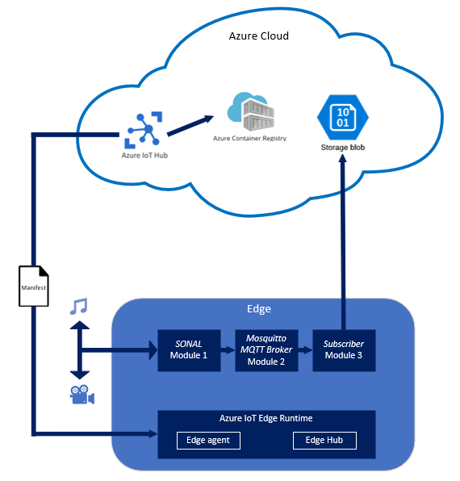

# IoT - Projet Securaxis : Documentation 

###### Dylan Canton & Salim Grayaa

###### 24.11.2022

---

## Architecture

Le schéma ci-dessous montre l'architecture utilisée pour l'implémentation de ce projet.

---

L'utilisation de l'écosystème Azure et de ses éléments joue un rôle central. Cependant seulement certains éléments ont été utilisé dans ce projet :

**Azure IoT Hub**

L'*Azure IoT Hub* permet de gérer les messages des différents modules à l'aide du *Azure Iot Edge Runtime* installé sur le Device (Raspberry Pi). 

Il joue également un rôle au niveau de la gestion des images de containers, il récupère les images de conteneurs sur le *Container Registry* pour ensuite les transmettre au *Azure IoT Edge Runtime* sous la forme d'un manifest. Cela permet de mettre à jour les images des conteneurs des 3 modules présents sur le Device.

**Azure Container Registry**

Le *container registry* permet de stocker des images docker afin de les utiliser ensuite au niveau du Edge pour construire les 3 modules nécessaires au projet. Ces images sont récupérées depuis le *container registry* par *Azure IoT Hub*, qui va ensuite les transmettre au *Azure IoT Edge Runtime*, ce dernier va alors les utiliser pour construire les modules SONAL, MQTT Broker et Subscriber. 

L'utilisation d'un registre de container au sein même d'Azure, contrairement à l'utilisation d'un *DockerHub* par exemple, permet de rester dans l'écosystème et de tirer profit des facilités d'échange entre l'*Azure Container Registry* et l'*Azure IoT Hub*. 

**Storage blob**

Le *Blob Storage* est l'object storage d'Azure, il est utilisé par le module du Subscriber qui va y stocker les données récoltées par l'application SONAL, à savoir donc des fichiers audios et vidéos. 

**Azure IoT Edge Runtime**

Le *IoT Edge Runtime* est insttalé sur le Device pour lui permettre de communiquer avec l'*Azure IoT Hub*. 

---

Initialement, il était prévu d'utiliser le Broker MQTT d'Azure (*Azure IoT Hub MQTT*) présent dans le *Edge Hub* avec le module SONAL et le module du Subscriber. 

Cependant, alors que le *Edge Hub* parvient à se connecter correctement au module SONAL, il n'arrivent pas à se connecter au module du Subscriber ce qui rend impossible ensuite l'envoie des données au *Storage Blob*. Après plusieurs recherches, il s'est avéré que le Broker d'Azure ne peut se connecter qu'à un module à la fois et que son intégration ainsi que sa maintenance ont été abandonnés par Azure au profit d'autres brokers comme *Mosquitto*. Le choix a donc été fait d'utiliser à la place le Broker MQTT *Mosquitto* qui s'avère pleinement fonctionnel dans la solution actuelle. 

## Application

